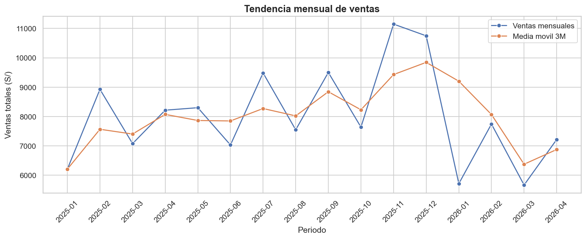
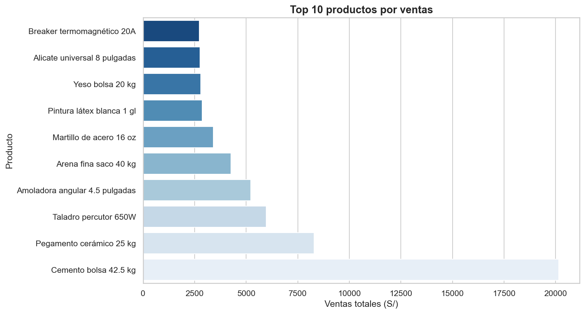
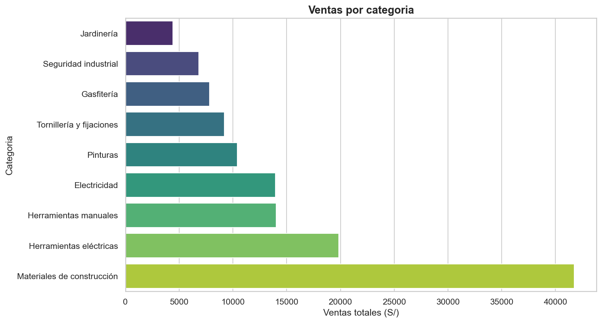
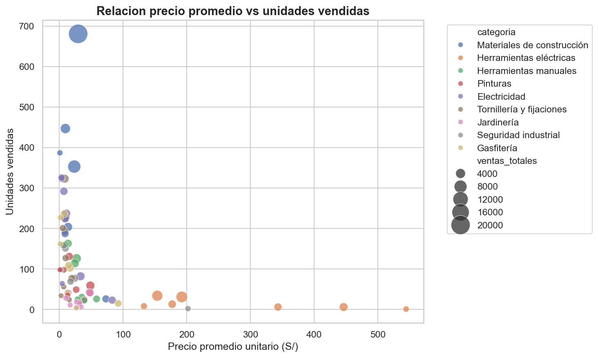

# Mini Proyecto - Analisis de Datos con Python

Analisis tecnico complementario al proyecto **Sistema de Business Intelligence - Ferreteria**.

Este proyecto utiliza el mismo dataset del Proyecto 1, pero se enfoca en el proceso analitico con Python: limpieza de datos, transformacion, analisis descriptivo, visualizaciones e insights de negocio.

## Objetivo

Demostrar capacidad de limpieza, transformacion y analisis de datos usando Python, Pandas y Jupyter Notebook.

El resultado esperado es un analisis tecnico reproducible que complemente el dashboard de Power BI desarrollado en el Proyecto 1.

## Stack

- Python
- Pandas
- NumPy
- Matplotlib
- Seaborn
- Jupyter Notebook
- Git
- GitHub
- Markdown

## Dataset

El dataset representa ventas e inventario de una ferreteria.

Archivos originales:

- `data/raw/productos.csv`
- `data/raw/ventas.csv`

Archivos procesados:

- `data/processed/productos_limpios.csv`
- `data/processed/ventas_limpias.csv`
- `data/processed/ranking_productos.csv`
- `data/processed/resumen_categorias.csv`
- `data/processed/resumen_mensual.csv`
- `data/processed/ranking_margen_productos.csv`

## Estructura del proyecto

```text
.
|-- data/
|   |-- raw/
|   |   |-- productos.csv
|   |   `-- ventas.csv
|   `-- processed/
|       |-- productos_limpios.csv
|       |-- ventas_limpias.csv
|       |-- ranking_productos.csv
|       |-- resumen_categorias.csv
|       |-- resumen_mensual.csv
|       `-- ranking_margen_productos.csv
|-- docs/
|   |-- documento-maestro.md
|   `-- guia-presentacion.md
|-- notebooks/
|   `-- analisis_datos_ferreteria.ipynb
|-- reports/
|   |-- figures/
|   `-- quality_report.csv
|-- src/
|-- README.md
`-- requirements.txt
```

## Analisis realizado

El notebook principal incluye:

1. Carga inicial del dataset.
2. Exploracion de estructura, tipos de datos, nulos y duplicados.
3. Limpieza y transformacion de datos.
4. Validacion del calculo de ventas.
5. Integracion de ventas con catalogo de productos.
6. Creacion de variables derivadas: periodo, trimestre, margen unitario, margen estimado y margen porcentual.
7. Analisis descriptivo de ventas, productos, categorias y meses.
8. Visualizaciones principales.
9. Insights de negocio.

## KPIs principales

| KPI | Resultado |
|---|---:|
| Ventas totales | S/ 128,182.96 |
| Unidades vendidas | 8,056 |
| Transacciones | 1,800 |
| Promedio de venta por linea | S/ 71.21 |
| Margen estimado | S/ 35,775.12 |
| Margen estimado % | 27.91% |

## Visualizaciones

### Tendencia mensual de ventas



### Top productos por ventas



### Ventas por categoria



### Relacion precio vs unidades vendidas



## Insights principales

- **Materiales de construccion** es la categoria con mayor venta total.
- **Cemento bolsa 42.5 kg** es el producto lider por ingresos.
- Existen productos de bajo precio con alta rotacion, como arena fina y ladrillo pandereta.
- Herramientas electricas genera ventas relevantes con pocas unidades, lo que indica mayor ticket promedio.
- La relacion entre precio promedio y unidades vendidas es negativa: `-0.3247`.
- Python permite auditar, limpiar y explicar tecnicamente los datos que luego pueden visualizarse en BI.

## Diferencia entre BI y analisis en Python

El Proyecto 1, desarrollado en Power BI, se enfoca en monitoreo ejecutivo, KPIs e interactividad visual.

Este Proyecto 2, desarrollado en Python, se enfoca en trazabilidad tecnica, limpieza, validacion, transformacion, analisis descriptivo y explicacion reproducible del proceso.

En resumen:

> Power BI ayuda a comunicar que esta pasando. Python ayuda a demostrar como se preparo, valido y analizo la informacion.

## Como ejecutar el proyecto

Instalar dependencias:

```powershell
pip install -r requirements.txt
```

Abrir el notebook:

```text
notebooks/analisis_datos_ferreteria.ipynb
```

Kernel usado durante el desarrollo:

```text
Python (mini-analisis-python)
```

## Estado del proyecto

Proyecto completo para presentacion en portafolio y entrevista.

## Autor

Edelson Orihuela
